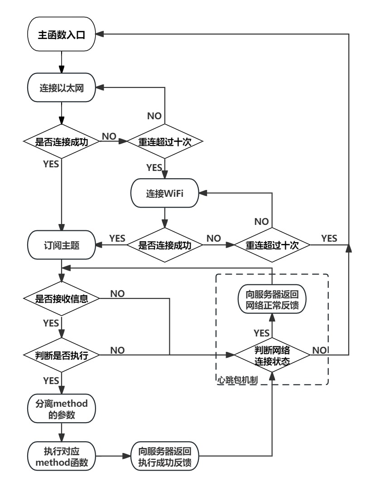

[TOC](文章目录)

---

# WiFi-servo-controller

## 概述

本项目基于`Arduino`环境下的ESP32开发。使用ESP32及继电器对快速门电机控制器进行控制，并使用`MQTT`向本地服务器`EMQX`进行通讯。
如需修改，请先参阅[乐鑫科技](https://www.espressif.com.cn/en/products/sdks/esp-idf)中的开发引导了解ESP32模组开发相关概念和乐鑫物联网开发框架。

调试过程可对接EMQX本地服务器，具体教程可参考这篇博客:[图文手把手教程--ESP32 MQTT对接EMQX本地服务器(VSCODE+ESP-IDF)](https://blog.csdn.net/felix_tao/article/details/125882339?spm=1001.2014.3001.5506)

首先从**WiFi-servo-controller**[Github仓库](https://github.com/Kanomace/WiFi-servo-controller)获取项目资料，获取到的资料目录结构如下:

```bash
.根目录
├── Cloud Server
├── Hardware                           硬件资料
│   ├── BOM_V1_2023-08-09              硬件接线图
│   ├── BOM_V1_2023-08-09              物料清单
│   ├── Gerber_V1_2023-08-09           PCB制版文件
│   ├── PCB_V1_2023-08-09              PCB文件
│   └── SCH_Schematic_V1_2023-08-09    原理图文件
├── Software                           软件资料
│   ├── Example                        参考例程
│   │   ├── MQTT_connect.ino           MQTT连接例程
│   │   └── MQTT_control.ino           MQTT控制例程
│   └── main
│       └── main20230813.ino           ESP32代码
├── Fig                                图表
│   ├── architectureV2.jpg             系统整体架构图
│   └── software.jpg                   程序执行流程图
├── .git                               git仓库文件
├── .gitattributes                     git仓库文件
└── README.md               
```
---

## 系统架构

<center>

</center>

---

## 硬件连接

继电器接口:
- H6(上行端口)  ->  **IO25** 
- H7(下行端口)  ->  **IO26**  
- H8(停止端口)  ->  **IO27**  

---

## 程序执行流程

<center>

</center>
 
---

## 通信协议

1. **远程控制开关门:订阅MQTT开关门控制主题**

- 主题名称: `DoorControl`
- 内容格式: `DoorControl/ID/Sender/Operation`
<br>其中:
- ***DoorControl*** : 远程控制开关门：订阅MQTT开关门控制主题。
- ***ID***          : 表示通讯板的ID，使用三位数字表示。( `001`: 001号通讯板，`031` : 031号通讯板)
- ***Sender***      : 表示信息传输方。(`TX`:服务器传输给通讯板的指令,`RX`:通讯板传输给服务器的信息)      
- ***Operation***   : 表示此次信息执行的操作。(`1`: 开门, `0`: 关门, `-1`: 停止)
<br>例如 :
<br>`DoorControl/001/TX/1` 表示**001号通讯板**接收到来自**服务器**的推送信息，执行相应的关门动作。通讯板返回信息`DoorControl/001/RX/1` 

2. **定时设置:订阅定时设置主题**

- 主题名称: `TimerSetting`
- 内容格式: `TimerSetting/ID/Sender/Operation/Hour/min
`<br>其中:
- ***TimerSetting*** : 远程控制开关门：订阅MQTT开关门控制主题。
- ***ID***           : 表示通讯板的ID，使用三位数字表示。( `001`: 1号通讯板，`031` : 31号通讯板)
- ***Sender***       : 表示信息传输方。(`TX`:服务器传输给通讯板的指令,`RX`:通讯板传输给服务器的信息)      
- ***Operation***    : 表示此次信息执行的操作。(`1`: 定时开启, `0`: 定时关闭, `-1`: 关闭定时功能)
- ***Group***        : 表示定时器设置的组别，一个通讯板默认设置十个定时器。(`0`~`9`: 定时组别)
- ***Hour***         : 表示定时功能的时钟设置。(`07`: 7时XX分 , `11`: 11时XX分)
- ***min***          : 表示定时功能的分钟设置。(`04`: XX时04分, `59`: XX时59分)
<br>例如:
<br>`TimerSetting/001/TX/1/0/07/04` 表示**001号通讯板**接收到来自**服务器**的推送信息，第0组定时器使能，在07:04时刻打开风门。通讯板返回信息`TimerSetting/001/RX/1/0/07/04`
<br>`TimerSetting/001/TX/0/5/11/59` 表示**001号通讯板**接收到来自**服务器**的推送信息，第5组定时器使能，在11:59时刻关闭风门。通讯板返回信息`“TimerSetting/001/RX/0/5/11/59`
<br>`TimerSetting/001/TX/-1/9/11/59` 表示**001号通讯板**接收到来自**服务器**的推送信息，第9组定时器关闭。通讯板返回信息`TimerSetting/001/RX/-1/9/11/59`

3. **查询定时列表:查询通讯板定时设置主题**

- 主题名称: `Listing`
- 信息格式: `Listing/ID/TX`
<br>其中:
- ***Listing***    : 远程控制开关门：订阅MQTT开关门控制主题。
- ***ID***         : 表示通讯板的ID，使用三位数字表示。( `001`: 1号通讯板，`031` : 31号通讯板)
- ***Sender***     : 表示信息传输方。(`TX`:服务器传输给通讯板的指令,`RX`:通讯板传输给服务器的信息)      
<br>例如:
<br>`Listing/001/TX`表示**001号通讯板**接收到来自**服务器**的推送信息。
通讯板返回信息`Listing/ID/RX/Group1/state/hour/min/Group2/state/hour/min/Group3……`

4. **心跳包机制**
- 主题名称: `Heartbeat`
- 信息格式: `Heartbeat/ID/TX`
<br>其中:
- ***Heartbeat***    : 远程控制开关门：订阅MQTT开关门控制主题。
- ***ID***         : 表示通讯板的ID，使用三位数字表示。( `001`: 1号通讯板，`031` : 31号通讯板)
- ***Sender***     : 表示信息传输方。(`TX`:服务器传输给通讯板的指令,`RX`:通讯板传输给服务器的信息)

心跳包机制为接收到信息格式 `Heartbeat/ID/TX`的心跳请求时，返回`Heartbeat/ID/RX`的心跳信息      
<br>例如:
<br>`Heartbeat/001/TX`表示**001号通讯板**接收到来自**服务器**的推送信息。
<br>通讯板返回信息`Heartbeat/ID/RX`

---

## 修改WiFi信息

 通讯板可通过两种方法修改内置WiFi信息

 1. **修改`Software/main/main.ino`中内置WiFi信息，并通过*Arduino.ide*烧录**

 ```c
 // WiFi
const char *ssid = "huangjiacheng"; // Enter your WiFi name
const char *password = "88888888";  // Enter WiFi password
 ```
 用户需要根据采用的`WiFi`的具体信息进行适配操作

 2. **使用串口进行WiFi信息修改**

 使用`CH340`或其他USB转TTL模块连接ESP32通讯板与PC
<br> PC上用户可通过任意串口调试软件[推荐使用*Arduino.ide*](https://www.arduino.cc/en/software)
<br>`MCU`通信串口硬件配置为：**波特率115200、8位有效数据、无奇偶校验、1位停止位**

串口接线:
- **PC**   --  **ESP32**
- **TXD**  --  **IO9** 
- **RXD**  --  **IO10**  
- **GND**  --  **GND**  

 ```c
<< changeWIFI\n
>> Enter your WiFi name
<< huangjiacheng
>> Enter your WiFi name
<< 88888888
>> OK
 ```

---

## 开发日记

1. **看门狗饱和导致ESP32重启，注意esp32-timer-hal.c中定时器和中断函数是不可被阻塞的**

解决方法：加个定时器标志位，在`main`中执行中断函数
参考博客：
[ESP32触发定时器中断后无限重启](https://blog.csdn.net/Beihai_Van/article/details/125793806?ops_request_misc=&request_id=&biz_id=102&utm_term=sGuru%20Meditation%20Error:%20Core%20%20&utm_medium=distribute.pc_search_result.none-task-blog-2~all~sobaiduweb~default-1-125793806.142^v92^insert_down28v1&spm=1018.2226.3001.4187)

2. **隔次开机会有概率连接不上WiFi网络**

导致原因未知 
<br>解决方法：使用ESP内置函数`ESP.restore` 在连接不上WiFi时,尝试重启ESP32

## 参考资料
- [图文手把手教程--ESP32 MQTT对接EMQX本地服务器(VSCODE+ESP-IDF)](https://blog.csdn.net/felix_tao/article/details/125882339?spm=1001.2014.3001.5506)
- [MQTT服务器搭建和ESP32实现MQTT代码](https://blog.csdn.net/wcc243588569/article/details/123557400?spm=1001.2014.3001.5506)
- [ESP32 连接到免费的公共 MQTT 服务器](https://www.emqx.com/zh/blog/esp32-connects-to-the-free-public-mqtt-broker?utm_source=mqttx&utm_medium=referral&utm_campaign=mqttx-help-to-blog)
- [ESP8266 + MQTT ：如何实现 LED 灯的远程控制](https://www.emqx.com/zh/blog/esp8266_mqtt_led)